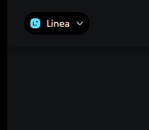
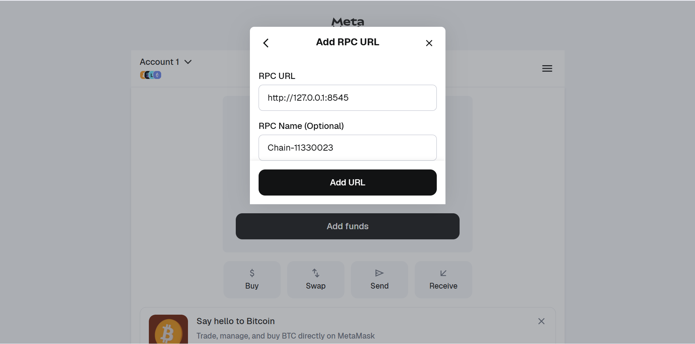
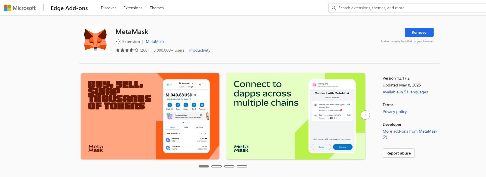
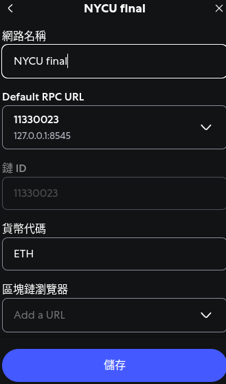
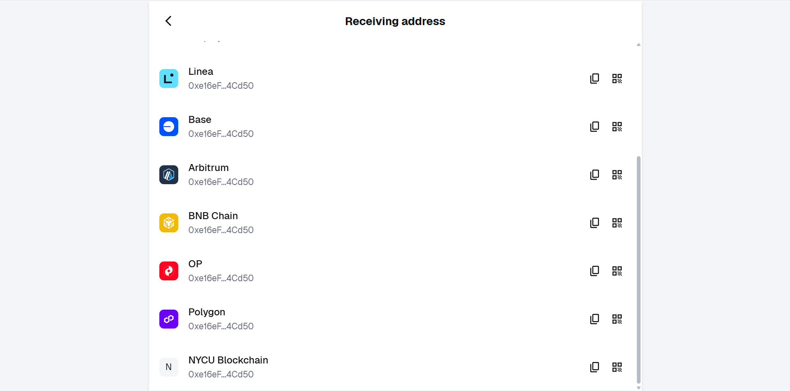
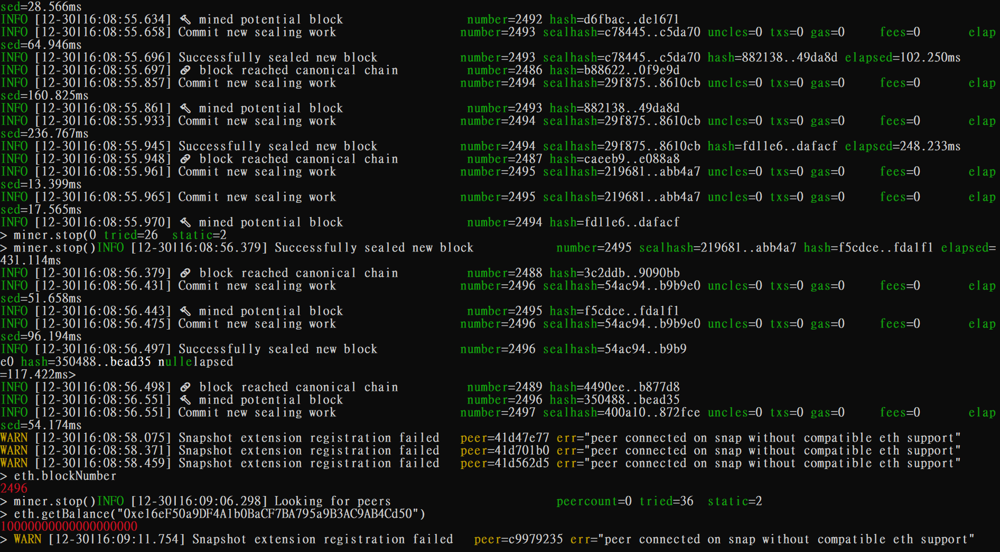
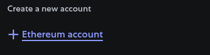
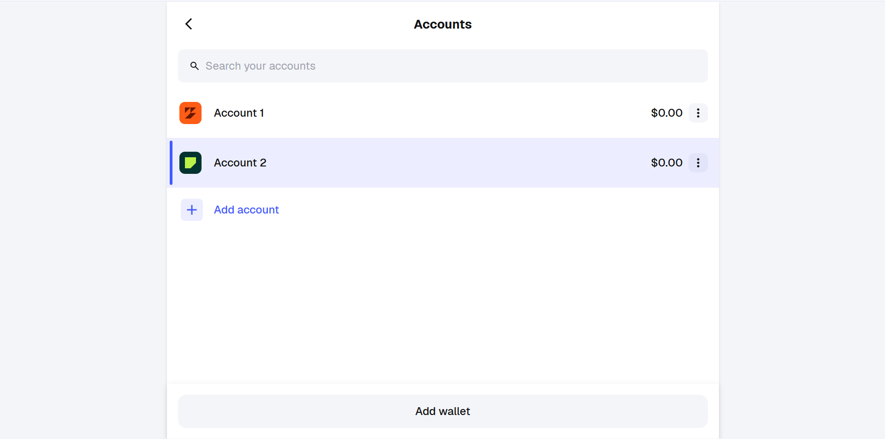

# 🛒 二手交易市場 DApp

基於以太坊智能合約的二手商品交易平台，具備 Escrow（托管）機制保障買賣雙方權益。

## 📋 專案簡介

這是一個去中心化的二手交易市場，賣家可以上架商品，買家付款後資金會進入智能合約托管，直到買家確認收貨後才會釋放給賣家，確保交易安全。

### 功能特色

- ✅ 商品上架與瀏覽
- ✅ Escrow 托管機制
- ✅ 確認收貨 / 退款機制
- ✅ 爭議處理
- ✅ MetaMask 錢包整合
- ✅ 響應式網頁設計 (RWD)

---

## 🏗️ 專案結構

```
secondhand-marketplace/
│
├── README.md
│
├── contracts/                  # Solidity 智能合約
│   ├── Escrow.sol             # 托管合約
│   └── Marketplace.sol        # 市場合約
│
└── frontend/                   # 網頁前端
    ├── index.html             # 主頁（商品列表 + 上架）
    ├── product.html           # 商品詳情頁
    ├── my-orders.html         # 我的訂單頁
    ├── css/
    │   └── style.css          # 樣式表
    └── js/
        ├── abi.js             # 合約 ABI 與地址
        └── app.js             # 前端主程式
```

---

## 🔧 環境需求

- [MetaMask](https://metamask.io/) 瀏覽器擴充套件
- [Remix IDE](https://remix.ethereum.org/) 用於部署合約
- 現代瀏覽器（Chrome、Firefox、Edge）
- VS Code + Live Server（用於本地測試）

---

## 🚀 快速開始

### 1. 設定 MetaMask 私有鏈

在 MetaMask 中新增自訂網路：

| 欄位 | 值 |
|------|-----|
| 網路名稱 | NYCU Private Chain |
| RPC URL | `http://your-rpc-url:8545` |
| Chain ID | `11330023` |
| 貨幣符號 | ETH |

### 2. 部署智能合約

1. 開啟 [Remix IDE](https://remix.ethereum.org/)
2. 建立 `Escrow.sol` 和 `Marketplace.sol`
3. 編譯合約（Solidity 0.8.x）
4. 選擇 **Injected Provider - MetaMask**
5. 部署 **Marketplace** 合約
6. 複製合約地址

### 3. 設定前端

編輯 `frontend/js/abi.js`，填入部署後的合約地址：

```javascript
const MARKETPLACE_ADDRESS = "0x你的合約地址";
```

### 4. 啟動前端

**方法一：VS Code Live Server**
```
1. 在 VS Code 安裝 Live Server 擴充套件
2. 對 index.html 按右鍵 → Open with Live Server
```

**方法二：Python HTTP Server**
```bash
cd frontend
python -m http.server 8080
# 開啟 http://localhost:8080
```

---

## 📖 使用說明
### MetaMask錢包安裝
- 先去Extension下載

- 完成後點開並且設定密碼
- 點選左上角新增網路
    - 
    - 
- 填寫RPC URL
    - 
- 完成後儲存
    - 

### 如何獲得基礎的錢進行測試？
- 複製錢包的address
    - 
- 把錢轉到自己的錢包下。
    ```bash
    eth.sendTransaction({from: eth.accounts[0], to: "0x60d8454EfB9a0E796Da51A52329C3B88EBF37aB9", value: web3.toWei(10, "ether")})
    ```
- 記得在後台啟動miner.start()去把這筆紀錄挖出來。（建議挖完馬上關，不然後面難度會太高！）

- 最後點選右上角的連接錢包就會透過你的extension問你是否要連接錢包！

### 額外新增買家進行測試。
- 
- 
- 
### 賣家流程
1. 連接 MetaMask 錢包
2. 在首頁填寫商品資訊（名稱、描述、價格）
3. 點擊「上架商品」
4. 確認 MetaMask 交易
5. 等待買家購買
6. 買家確認收貨後收到款項

### 買家流程

1. 連接 MetaMask 錢包
2. 瀏覽商品列表
3. 點擊「查看詳情」選擇商品
4. 點擊「購買此商品」
5. 確認 MetaMask 交易（付款）
6. 收到商品後點擊「確認收貨」
7. 資金釋放給賣家

### Escrow 托管狀態

| 狀態 | 說明 |
|------|------|
| Created | 已建立，等待付款 |
| Funded | 已付款，資金鎖定中 |
| Confirmed | 買家確認收貨，交易完成 |
| Refunded | 賣家同意退款 |
| Disputed | 買家提出爭議 |

---

## 📝 智能合約說明

### Marketplace.sol

主要市場合約，負責商品管理。

**主要函式：**

| 函式 | 說明 |
|------|------|
| `listProduct(name, description, price)` | 上架商品 |
| `purchaseProduct(productId)` | 購買商品 |
| `cancelProduct(productId)` | 取消上架 |
| `getAvailableProducts()` | 取得所有可購買商品 |
| `getProduct(productId)` | 取得單一商品資訊 |
| `getBuyerOrders(buyer)` | 取得買家訂單 |
| `getSellerProducts(seller)` | 取得賣家商品 |

### Escrow.sol

托管合約，每次購買時自動建立。

**主要函式：**

| 函式 | 說明 |
|------|------|
| `fund()` | 買家付款 |
| `confirmReceived()` | 買家確認收貨 |
| `refund()` | 賣家同意退款 |
| `raiseDispute()` | 買家提出爭議 |
| `getDetails()` | 取得托管詳情 |

---

## 🔐 安全機制

1. **資金托管**：買家付款後資金鎖定在 Escrow 合約中
2. **身份驗證**：只有買家能確認收貨，只有賣家能同意退款
3. **狀態檢查**：每個操作都有狀態檢查，防止重複執行
4. **防止自買**：賣家無法購買自己的商品

---

## ⚠️ 注意事項

- 此專案運行在私有鏈 Chain ID: **11330023**
- 請勿從共用帳戶轉出大量 ETH（超過 100 ETH）
- 測試前請確認 MetaMask 已連接到正確的網路
- 價格單位為 ETH，合約內部使用 Wei

---

## 🛠️ 技術棧

**智能合約：**
- Solidity ^0.8.0
- Remix IDE

**前端：**
- HTML5 / CSS3
- JavaScript (ES6+)
- Web3.js 1.10.0

---

## 📄 授權條款

MIT License

---
